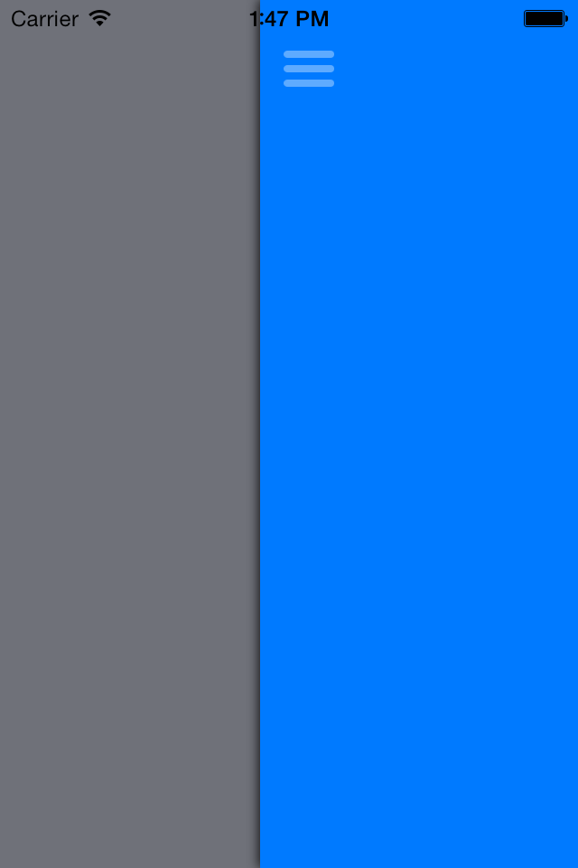

SplitPeekViewController
------------------------

A custom made split controller that uses a two separate controllers displayed on a main view controller. This is designated if you wanted to be able to move both front and back views in a split view controller menus.

